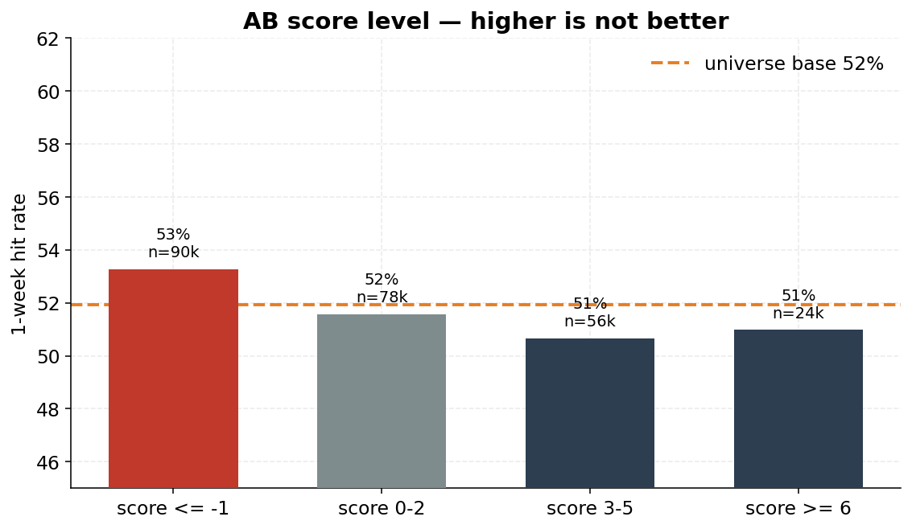
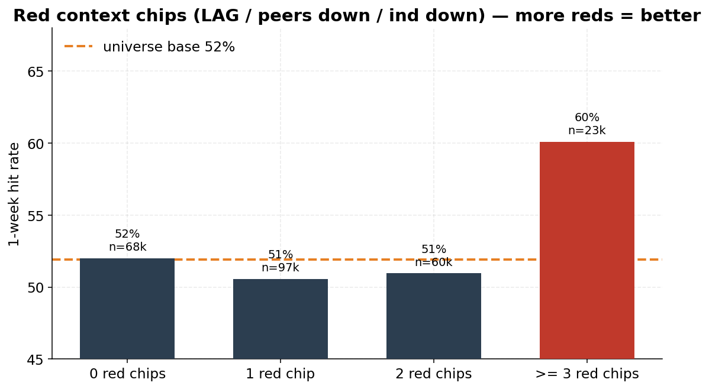
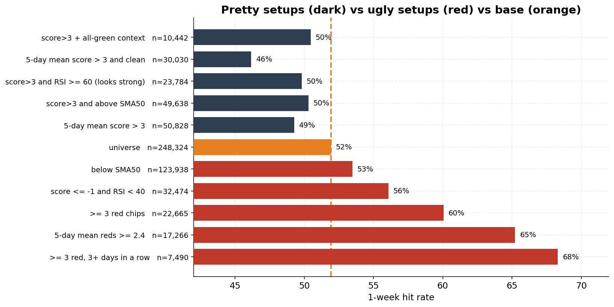
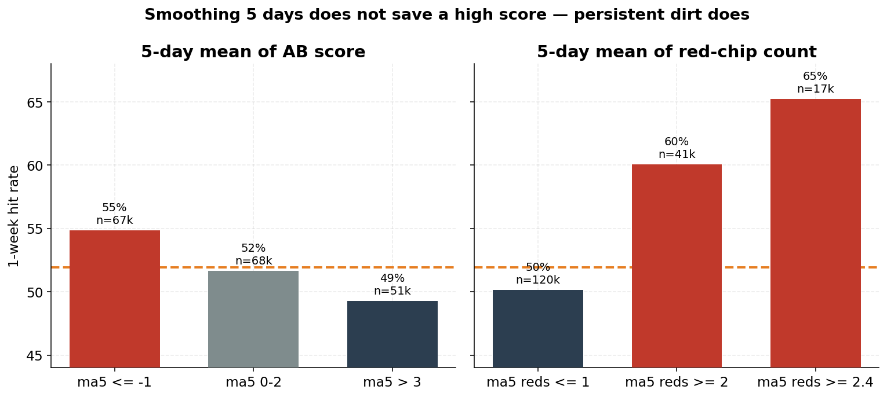

# AB score — does it help? (6-month universe)

248,324 name-sessions, **2026-02-19 → 2026-07-06** (resume checkpoint; last 32 sessions still scoring).
Test: from that day’s close, was max upside > |max downside| over the next week (1w hit rate).
Universe base = **52%**. Orange line on the charts is that base.

**Verdict: as a buy-the-greens / buy-score>3 ranker, no. The edge is the ugly tail (sign flipped).**

## 1. Higher AB score is not better

| score | n | 1w hit |
|-------|--:|-------:|
| ≤ -1 | 90,042 | 53% (+1) |
| 0–2 | 78,034 | 52% (0) |
| 3–5 | 56,133 | 51% (−1) |
| ≥ 6 | 24,115 | 51% (−1) |
| **> 3 (the cut)** | 58,041 | **51% (−1)** |

## 2. Fewer red chips is not better — more reds is

Red chip = LAG / peers↓ / ind↓ / sec↓ that session. White does not count.

| red chips | n | 1w hit |
|-----------|--:|-------:|
| 0 | 68,494 | 52% (0) |
| 1 | 96,670 | 51% (−1) |
| ≤1 (clean day) | 165,164 | 51% (−1) |
| 2 | 60,495 | 51% (−1) |
| **≥ 3 (LAG+peers↓+ind↓)** | 22,665 | **60% (+8)** |

## 3. Pretty vs ugly — one picture

Dark = the setup that looks like a buy. Red = the opposite. Orange = base.

| cut | n | 1w |
|-----|--:|---:|
| score>3 ∧ all-green context | 10,442 | 50% (−1) |
| 5-day mean score > 3 and clean | 30,030 | **46% (−6)** |
| score>3 ∧ RSI ≥ 60 | 23,784 | 50% (−2) |
| score>3 ∧ above SMA50 | 49,638 | 50% (−2) |
| 5-day mean score > 3 | 50,828 | 49% (−3) |
| **universe** | 248,324 | **52%** |
| below SMA50 | 123,938 | 53% (+2) |
| score ≤ -1 ∧ RSI < 40 | 32,474 | 56% (+4) |
| ≥ 3 red chips | 22,665 | **60% (+8)** |
| 5-day mean reds ≥ 2.4 | 17,266 | **65% (+13)** |
| ≥ 3 red, 3+ days in a row | 7,490 | **68% (+16)** |

SMA50 is already inside the score as A09 (+1 above / −1 below). 85% of score>3 names are already above SMA50. That is why the chart looks good.

## 4. 5-day mean of the score does not save it

Averaging five pretty days makes the pretty cut *worse* (49%, −3). Averaging five dirty days is the actual signal (65%, +13).

## What “helps” means

- **Intended direction (higher score, green context, above SMA50): no pocket worth using.** First day it crosses >3, score ≥ 8, close-to-close instead of excursion, Financials-only +3pp — none of that is a system.
- **Opposite direction: yes.** LAG + peers↓ + ind↓, especially if it lasts 3–5 days, below SMA50, RSI < 40. Close-to-close agrees (60% 1w win, median close **+1.6%** vs universe +0.1%).

Per-ticker rows: `2026-02-19_2026-08-19_universe.parquet` (local / after the live job). This AUDIT file is a snapshot so it cannot collide with the still-running PIT job.
